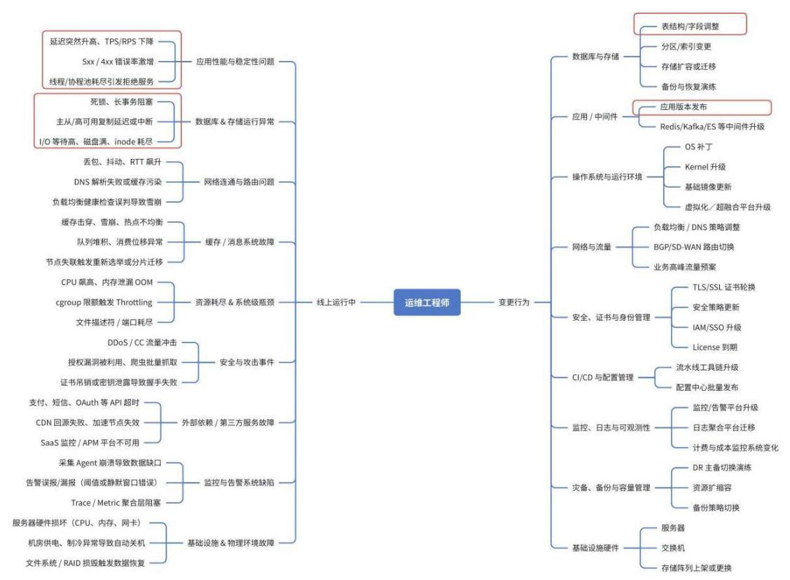
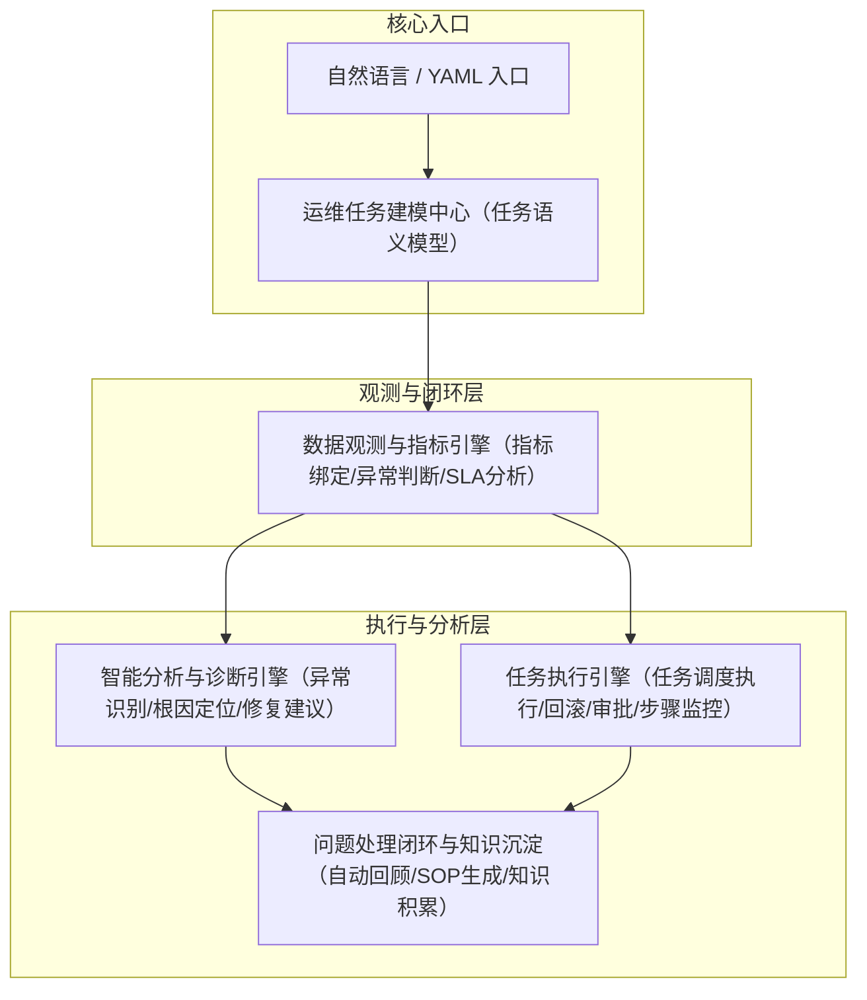
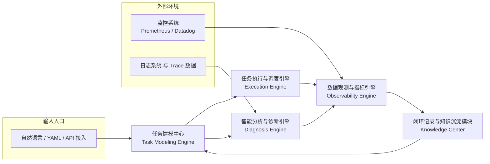
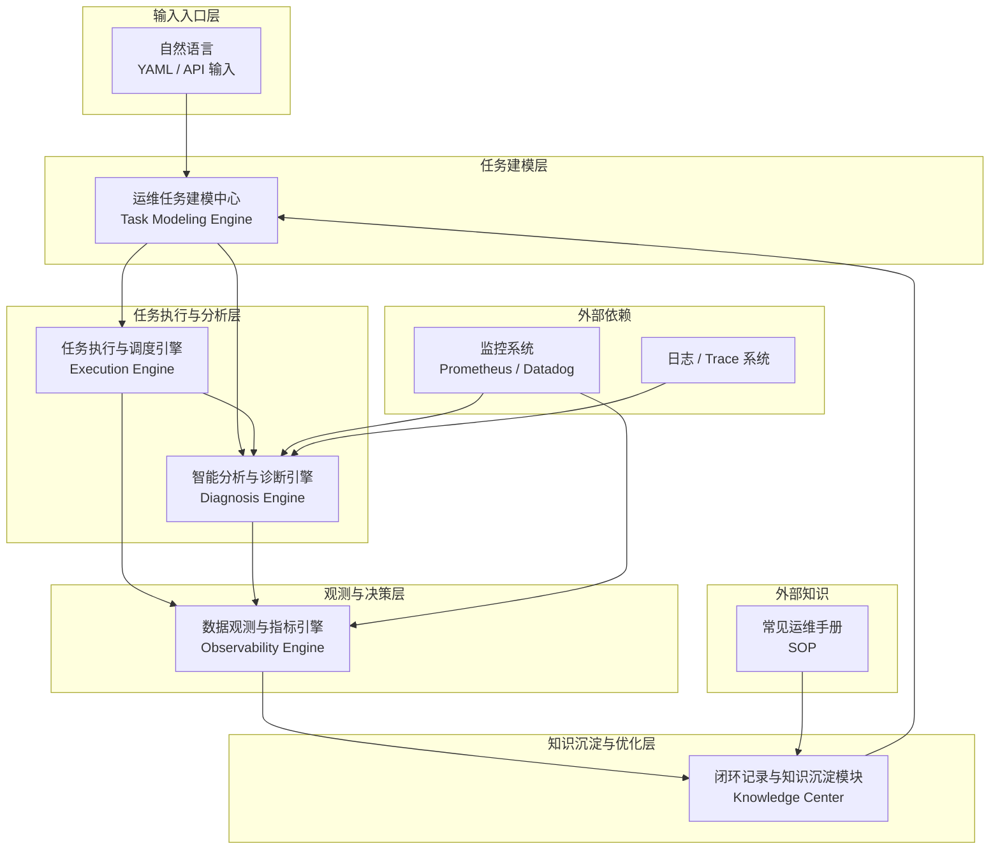
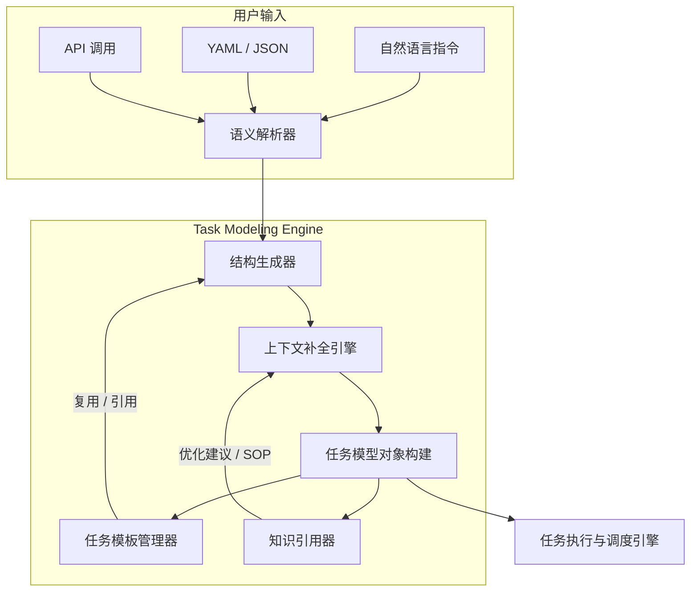
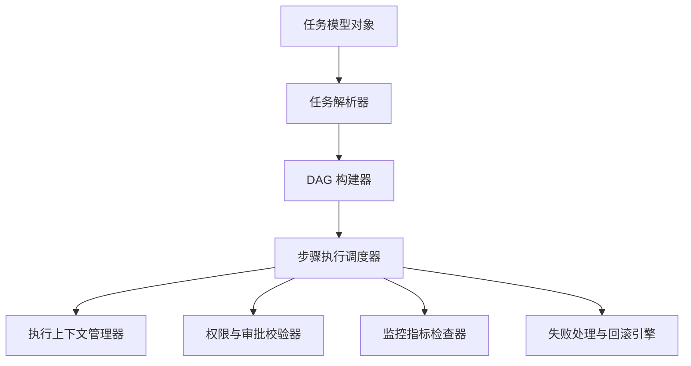
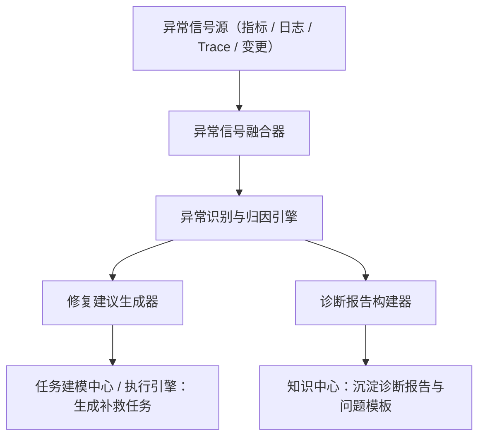
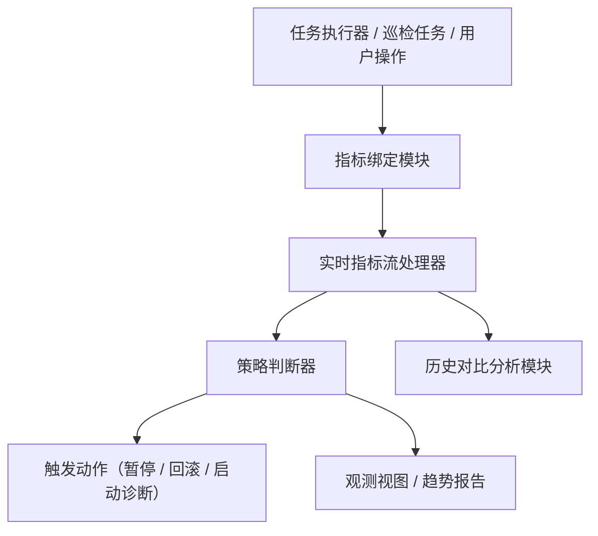
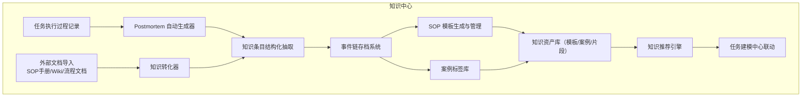
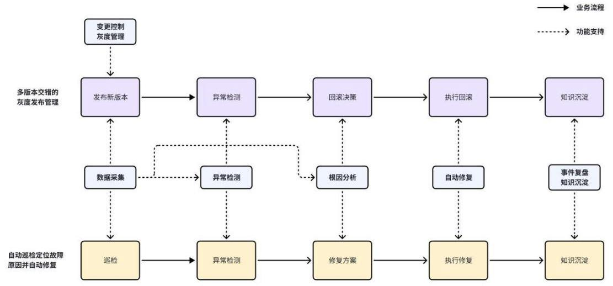

# **ZeroOps 智维中枢**

# 1. 产品概述

## 1.1 产品名称

**ZeroOps 智维中枢**

ZeroOps 是一个专为软件开发团队打造的 AI 运维自治中枢系统,帮助开发者摆脱对传统运维团队的依赖,让每个开发者都拥有自己的智能运维团队,实现“零人工运维”的未来。

## 1.2 产品背景与机会点

随着软件系统规模和复杂度不断提升,企业面临的运维挑战日益严峻。传统由“运维团队主导”的运维体系,正面临以下显著问题:

#### a. 高频次、高并发的支持压力

现代研发团队在 CI/CD、微服务、云原生架构下产生了大量日常运维需求,如环境部署、发布、日志查询、资源扩缩容、健康检查等,严重依赖运维团队频繁响应与配置,形成瓶颈。

#### b. 问题复杂度急剧提升

当前线上问题涉及的系统模块广泛,故障链路复杂,排查过程依赖跨系统、跨层级的综合判断,超出传统“经验驱动”运维人员的响应能力上限。

#### c. 缺乏实时、精准的感知与响应机制

运维团队往往依赖监控告警系统被动感知问题,且缺乏自动化闭环能力,故障处理流程严重依赖人力判断与操作,无法快速定位、恢复与预防。

#### d. 专业知识门槛高,运维人难招难留

运维岗位对系统架构、安全策略、网络协议、服务依赖、资源调优等多维知识有很高要求,招人难、培训难、流动性高,导致体系不稳定。

#### e. 人为失误频发,系统风险难控

关键操作如数据库变更、核心服务部署、配置下发等一旦出错,极易引发生产事故。即使有 SOP(标准操作流程),也仍需依赖经验丰富人员执行,形成不可控风险。

#### f. 建设运维团队的成本不断攀升

在 DevOps 要求“敏捷 + 稳定”的前提下,企业需投入大量资源维持一个高效、可靠的运维团队,其人力、流程、知识沉淀成本正在成为业务扩张的阻力。

在此背景下,企业普遍开始探索“去运维化”或“AI 驱动自治运维”的新模式。虽然 AIOps 产品近年逐渐兴起,但多数聚焦于告警分析、日志归因、数据洞察等“辅助决策”,本质上仍服务于专业运维人员,并未真正解放开发者或替代运维角色本身。

这为一种全新产品形态带来机会: 由AI驱动的、可面向开发者使用的、具备独立认知与执行能力的“智能运维体”。

ZeroOps 正是在这一趋势下诞生,致力于彻底重构运维体系结构,实现从“人等机器” 向“机器等人”的转变 ——

让开发者无需依赖传统运维团队,即可安全、智能、高效地完成各类系统运维任务。

## 1.3 产品定位

ZeroOps 是一个由 AI 驱动、面向软件开发者的智能运维自治系统,旨在取代传统运维团队的核心职责,全面承接包括部署发布、系统巡检、故障处理等在内的日常与突发运维任务,实现标准化、可配置、自动化的运维服务交付。通过这一模式,降低团队对传统运维人力的依赖,提升系统响应效率与稳定性。

### 我们做什么(What ZeroOps Does)

ZeroOps 致力于成为软件开发团队的智能运维执行中枢,提供一整套覆盖主动性日常运维任务执行、突发异常处理与团队变更协同的 AI运维能力,核心能力包括:

#### 1. 日常运维任务的自动化执行

支持开发者通过自然语言、API 或自定义触发规则,完成以下高频运维操作的自动执行与反馈:

- 应用/服务的部署发布与版本回滚;

- 服务启停、扩缩容、配置更新；

- 环境初始化与多服务编排;

- 日志、指标、资源状态的查询与排查；

- 任务调度、脚本运行、备份恢复等通用运维动作。


#### 2. 系统状态感知与异常处理闭环

ZeroOps 内建系统运行态监测能力,结合规则驱动与智能分析模型,在系统出现潜在异常或告警信号时,可自动完成:

- 问题识别与异常分级判断;

- 根因分析与问题定位(结合日志、指标、拓扑)；

- 自动修复动作(重启、限流、扩容、回滚等)；

- 整个处理过程的记录与验证反馈。

#### 3. 变更流程与任务协同支持

运维任务支持与团队内部发布协同流程对接,包括:

- 任务审批控制、权限约束与变更窗口调度,支持任务串行/并行执行；

- 支持任务定时执行、预发布与延迟执行；

- 保障运维变更在组织内具备协作性、可控性与可回溯性。

#### 4. 运维任务标准化与知识沉淀

所有操作均基于标准化任务模型构建,可复用、可配置,并支持知识模板沉淀与版本化管理,降低团队维护复杂度。

### 我们不做什么 (What ZeroOps Does Not Do)

ZeroOps 聚焦于“运维任务的智能执行”这一核心职能,避免构建庞大复杂的全栈平台, 明确不重复造轮子,边界如下:

#### a. 不重建已有运维基础设施工具

ZeroOps 不负责自建、替代或复刻以下常见系统工具和平台能力,而是通过标准集成方式与之协作:

- 监控/告警系统(如 Prometheus、Grafana、Datadog 等)

- Cl/CD 发布系统(如 Jenkins、GitLab CI、流水线平台等)

- 资源编排与环境管理工具(如 Kubernetes、Terraform 等)

- 脚本平台/自动化工具链(如 Ansible、SaltStack、自定义运维动作脚本等)

#### b. 不构建庞杂全栈平台

我们不追求将产品拓展为大而全的平台系统,不承担 DevOps、监控、发布、安全、权限、编排等所有职能,而是聚焦于构建一个低门槛、轻量、易接入的智能运维中枢,实现最小可用闭环,支持渐进式演进。

#### c. 暂不支持多租户与团队隔离能力

当前版本 ZeroOps 专注于单团队使用场景,尚不准备支持多租户模式下的团队隔离、跨组织资源权限分配与集中管控。多团队权限隔离、资源空间划分能力将纳入产品后续 Roadmap。

#### d. 暂不覆盖安全合规与审计体系建设

目前 ZeroOps 提供基础操作可追溯能力,但暂不具备完整的权限模型、安全审批机制与合规审计体系。安全能力将作为后续阶段重点建设方向,确保未来产品满足企业级可控性需求。

## 1.4 产品愿景

ZeroOps 的长期目标是成为软件开发团队的智能运维 AI 搭档,构建一个具备知识积累、经验迁移与自我进化能力的 AI 运维专家系统，解决开发团队所有的常用标准运维场景的需求。

我们希望未来的 ZeroOps 能够:

- 像“经验丰富的资深运维工程师”一样,理解系统运行状态,识别问题根源,快速给出解决方案并执行落地;

- 结合各种标准运维操作手册,通过持续学习不同项目中的运维策略与操作流程, 形成成熟的智能运维知识库;

- 连接企业已有 DevOps 等工具体系,形成“自动执行 + 智能判断 + 协同变更”的一体化闭环平台；

- 最终让软件开发者真正“只需关注业务”,而无需被运维琐事所困扰。

ZeroOps 不只是一个工具,更是“下一代智能化开发组织的基础设施”。

# 2. 目标用户与使用场景

## 2.1 目标用户

### 核心用户画像

ZeroOps 的主要服务对象是中小型软件开发团队中的开发工程师,他们在缺乏独立运维团队支持、甚至不具备完善 DevOps 基础设施的环境中,承担着大量非核心但又不可或缺的日常运维工作。 这些开发者往往面临以下困境:

- 缺乏系统性运维经验,容易在操作中出错或效率低下；

- 被大量机械性、重复性、低智力密度的运维任务打断,影响业务开发效率；

- 无法快速响应线上突发问题,缺乏监测、定位、处理一体化的能力；

- 对工具链熟悉度不高,在发布、配置、资源管理上依赖少数“熟人协助”或SRE；

### 典型用户群体

- 业务线开发工程师 (最主要目标用户) 。 
  
  - 日常需要部署服务、排查问题、调整配置、申请资源等。
  - 通常掌握基本命令行/脚本能力, 但缺乏专业运维体系知识

- 技术团队中的平台/DevOps 工程师(次级用户)

  - 作为接口方为团队预置场景、接入工具、设定规则与权限

  - 期望降低“支撑服务”负担,让 ZeroOps 替代大量协同任务

- 早期创业团队

  - 希望以最小成本构建可用的运维体系,避免搭建专职 SRE 团队

  - 对工具可落地、易用性、复用率要求高


### 用户目标与价值期待

<table><tr><td>用户目标</td><td>ZeroOps 提供的价值</td></tr><tr><td>快速部署服务/发布新版本</td><td>支持自然语言或 API 一键发布、版本回滚、灰度控制等</td></tr><tr><td>遇到服务异常 / 收到告警</td><td>自动分析异常等级、根因定位、执行修复或给出建议</td></tr><tr><td>排查问题 / 查询状态</td><td>快速获取日志、监控数据、配置状态等,不用登录多台机器</td></tr><tr><td>编排初始化环境 / 多服务启动</td><td>通过模板或命令集,实现复杂服务编排一次完成,包括网络策略、 安置、跨机房部署、服务依赖顺序、负载均衡接入等系统初始化流程</td></tr><tr><td>脚本/任务协同 / 操作审批</td><td>结合变更流程,实现操作可控、可审批、可调度</td></tr><tr><td>沉淀运维经验 / 可复用</td><td>所有操作可配置为标准任务,复用或版本管理</td></tr></table>


## 2.2 使用场景分类

ZeroOps 覆盖的典型使用场景,主要围绕开发者日常与系统交互中常见的运维诉求展开。下面按两种不同场景分类方法,全面说明 ZeroOps 可服务的运维任务空间。

### 按“场景维度 × 操作模式”划分为五大类任务场景

#### 场景一:应用发布与服务变更

**核心价值**:降低发布与变更操作的门槛、错误率,实现标准化、自动化的服务管理。

**典型子场景**:

- 服务部署与版本回滚(支持灰度/批量/多环境)

- 配置更新与热重载

- 服务启停、扩缩容

- 存储 schema 变更

- Redis/Kafka/ES 等中间件升级

**触发方式**:开发者主动触发/变更审批流程

**ZeroOps 支持方式**:自然语言任务、API 调用、一键模板化任务

**用户收益**:发布更快更稳,变更过程更可控,降低依赖他人协作成本,更好地支持变更并发能力

#### 场景二:运行中问题排查与故障修复

**核心价值**:定期巡检系统,快速定位线上问题,自动判断异常等级,辅助或自动修复故障；同时智能调优系统资源配置,提升整体运行效率与成本表现。

**典型子场景**:

- 服务异常响应(如 CPU 飙高、TPS 降低、5xx 激增等)

- OOM / Throttling / 磁盘满 / 网络异常排查

- 日志抓取、Trace 分析、指标查询

- 自动触发扩容 / 重启 / 回滚等修复操作

- 动态资源调优与缩容回收:基于监控与策略,动态判断服务是否存在资源浪费或冗余实例,可自动发起缩容任务,降低云资源开销与系统负载

**触发方式**:定期巡检/监控告警/开发者主动排查/生产问题响应 
  
**ZeroOps 支持方式**:智能异常识别模型、问题闭环自动处理、策略型资源调度、辅助决策反馈机制


**用户收益**:问题响应时间缩短,排查过程更聚焦,降低误操作风险,资源利用率提升,整体运维成本下降

#### 场景三:环境初始化与资源编排

**核心价值**:简化多服务部署流程,提升一键化搭建复杂环境的能力。

**典型子场景**:

- 新项目上线环境初始化 (多服务 + 配置 + 网络规则)

-  模板化服务编排(服务依赖顺序、数据库初始化等)


- 安全策略/负载均衡/跨机房部署等系统配置预置


- 云资源创建、基础设施初始化等 IaC 任务

**触发方式**:项目服务扩展/环境重建/预置标准化模板

**ZeroOps 支持方式**:编排模板 + 参数注入 + 自动执行

**用户收益**:初始化流程简洁清晰、无需人工拼凑命令、环境标准化一致性好

#### 场景四:任务协同、调度与审批

**核心价值**:保障运维任务在团队协作中具备流程性、权限性、可控性。

**典型子场景**:

- 运维任务的审批调度(定时执行、窗口控制、串行并发)

- 权限规则设定与限制操作范围

- 与 ChatOps 工具协作使用(如 企业微信机器人、钉钉机器人)


**触发方式**:任务执行请求需审批/团队要求权限控制/异步任务调度

**ZeroOps 支持方式**:任务权限模型、审批链配置、执行计划设置

**用户收益**:流程更合规、多人协作更高效、权限更明确

#### 场景五:知识沉淀与标准化复用

**核心价值**:将运维知识模块化、标准化、版本化,形成团队共享的自动化资产。 

**典型子场景**:

- 将一次性命令沉淀为标准任务

- 运维 SOP 建模为可复用模板

- 运维脚本管理与版本控制

- 知识库关联日志 / 故障案例复盘

**触发方式**:运维执行后沉淀 / 新成员加入团队 / 多项目复用操作

**ZeroOps 支持方式**:任务抽象建模、可视化任务流、模板化导出/导入

**用户收益**:降低学习门槛,提升知识复用效率,增强组织传承能力

### 按运维工程师面临的“线上运行”和“变更行为”的场景划分:



## 2.3 示例场景

为更具体地展示 ZeroOps 在典型运维任务中的应用效果,以下列举了多个具象的使用场景,涵盖了从日常变更操作到故障响应、容量优化与流量治理的多个核心方向。每个场景都结合了实际背景、用户目标与 ZeroOps 的响应机制,展现其自动化能力与用户价值。以下四个示例场景将依次说明 ZeroOps 在不同任务场景下的工作机制与使用收益。

### 示例场景一: 多版本交错的灰度发布管理

**业务背景**
某 App 团队在 5 月份计划连续发布多个版本:

- 5 月 1 日:上线包含功能 A 的版本 v1.0,进入灰度阶段；

- 5 月 3 日:上线基于 A新增功能 B 的版本V1.1,计划直接灰度替代V1.0 ；

- 5 月 7 日:上线不包含 A、B,但加入全新功能 C 的版本 v1.2,需另行灰度；

多个版本处于灰度状态,且目标用户群、上线优先级、发布时间不一致,导致传统发布方式难以准确控制发布路径与灰度进度。

**操作流程**

 **a. 灰度策略建模**:
通过 ZeroOps 配置三套灰度规则:按用户标签、设备系统版本、地域等条件进行区隔灰度;

**b. 任务拆解与模板化**:
每个版本构建独立的部署模板,包含版本内容、依赖服务、回滚策略等元数据;

**c. 发布流程调度**

- 5 月 1 日触发 v1.0 发布任务,灰度比例初设为 5%,系统根据监控数据动态推进;

- 5 月 3 日触发 v1.1 发布, ZeroOps 自动识别与 v1.0 冲突,提示可复用部分配置并发出合并灰度建议,或切换新的灰度目标,同时灰度；

- 5 月 7 日 v1.2 上线,系统根据规则切换灰度目标群体,确保 A/B 用户不被影响;

**d. 实时观测与回滚支持**:
每个灰度阶段可视化监控关键 metrics, 异常指标触发回滚机制,按最小影响范围回退部署。

**系统支持方式**

- 多版本灰度管理支持 (支持并发灰度策略)

- 自动检测版本冲突与资源重用

- 灰度发布进度可视化与指标联动监控

- 支持 YAML/API/自然语言方式触发部署任务


**带来的收益**

-  灰度流程清晰可控,不再依赖开发者手工调配资源与脚本；

- 多版本并行管理效率显著提升,避免因版本交错带来的回滚错误；

- 异常响应机制完善,提升了版本上线的成功率与用户体验稳定性;

### 示例场景二: 数据库字段结构变更的稳健执行流程

**业务背景**

某业务模块因功能升级,需要将原有数据库表 `user_profile` 中的字段 `column_1` 替换为新的字段 `column_2`, `column_2` 在语义、字段类型上有所不同,不适宜直接通过 SQL 修改原有字段结构。以往开发人员手动在生产环境中执行 ALTER 操作或直接通过 APP 程序内部修改表结构,容易引发误操作或阻塞,甚至导致线上服务中断。为降低风险、提高安全性,该类变更需交由 ZeroOps 执行,并以可审计、可观测、可回滚的方式完成。

**目标诉求**

-  限制开发者、应用程序对生产数据库直接操作结构的权限；

- 建立标准的结构变更审批流程;

- 分步骤、渐进式、安全执行字段替换；

- 在每个关键步骤之间设置观察窗口,便于及时发现潜在异常；

- 整个流程自动记录、可审计、可追溯。

**标准操作流程**

ZeroOps 按以下步骤执行该字段结构变更任务:

**a. 开发者在发布任务中标注需要结构变更**

通过自然语言任务或 YAML 声明式任务配置,附带 schema 变更意图,例如 将 `column_1` 替换为 `column_2`,类型由 `string` 改为 `jsonb`。任务需提交审批。

**b. ZeroOps 触发结构变更流程 (经审批后)**

- Step 1:新增字段 column_2,与 column_1 并存,不影响当前业务逻辑；

- Step 2: 初始化数据迁移, 批量将 column_1 中数据转换并写入column_2;

- Step 3: 服务灰度验证 column_2 可用性,灰度版本服务访问 column_2, 校验数据一致性;

- Step 4: 切换主服务代码使用 column_2, 正式版本不再依赖 column_1;

- Step 5: 将 column_1 重命名为 column_1_deprecated,作为临时冗余字段保留;

- Step 6: 观察期运行若干天,无误后自动执行删除 column_1_deprecated 操作。


**c. 每一步均带状态监控与回滚能力**

- 数据迁移执行前自动生成对比快照;

- 观察期监控字段访问/错误率/延迟等指标;

- 变更日志自动存档,便于团队复盘与复制流程。

**系统能力支持**

- 自动化 schema 变更任务流建模与执行；

- 权限审批与执行分离机制;

- 数据迁移任务状态可视化、监控与回滚能力；

- 与代码发布流程联动,自动识别代码切换时机；

- 结构变更风险提示与历史变更案例引用。

**用户收益**

- 避免了高风险的人工直接操作；

- 开发者专注业务代码,结构变更由系统稳健执行；

- 全流程审计留痕,可快速复盘；

- 降低因数据库结构操作导致的线上故障概率；

### 示例场景三:自动巡检发现并定位内存泄漏

**业务背景**

某团队通过 ZeroOps 平台发布了新版本的 Go 语言应用。上线初期服务运行正常,但在接下来的几小时内,系统自动巡检发现该服务实例的内存使用持续上升,甚至部分实例触发了 OOM 警告。进一步排查后确认是由于 Goroutine 未被正确释放,导致内存泄漏问题逐步放大。

**目标诉求**

- 能在问题爆发前通过系统巡检及时发现异常;

- 提供内存异常趋势分析;

- 定位问题根因, 如代码层 goroutine 泄漏;

- 指导或自动触发修复手段,防止服务不可用扩大化；

- 全流程闭环, 形成可追溯的问题处理记录。

**自动检测与处理流程**

ZeroOps 借助内建巡检任务与智能异常分析,自动识别并处理该问题,流程如下:

**a. 内存使用趋势预警**

- 巡检任务定期收集服务运行指标;

- 系统检测到特定服务实例的内存占用呈线性上升趋势,达到预警阈值；

- 自动触发“内存使用异常”分析任务。

**b. 智能定位问题类型**

- 分析过程中结合堆栈快照、Prometheus 指标、pprof 数据等;

- 自动识别 goroutine 数量异常增长 (例如常驻 10k+ goroutine 且未释放);

- 调用历史行为对比机制,确认该模式为异常行为,非业务高并发造成。

**c. 生成初步诊断与修复建议**

- 系统报告指出:存在 goroutine 泄漏的风险,代码中的某异步处理逻辑未及时退出;

- 附带 pprof 可视化报告、关键代码路径截图;

- 系统提供可选动作建议,如实例重启、流量切换、版本回滚。

**d. 修复动作执行(用户确认)**

- 团队确认问题后,通过 ZeroOps 执行灰度实例滚动重启,缓解泄漏扩散；

- 配置自愈策略:若同类问题再次出现,自动触发实例限流与替换。


**e. 问题闭环记录与知识沉淀**

- 整个巡检与诊断过程形成一条事件链；

- 问题分析报告归档入问题知识库;

- 修复流程沉淀为标准应对模板, 可供未来复用。

**系统能力支持**

- 实时指标采集与巡检任务自动化执行,集成 pprof 与 goroutine 行为模型智能识别；

- 异常等级评估与建议动作决策;

- 修复动作一键触发 + 故障前后指标对比；

- 问题处理过程自动记录与知识沉淀支持。

**用户收益**

- 提前发现高风险问题,避免因内存泄漏导致服务雪崩；


- 大幅减少人工排查时间,提升故障处理效率；


- 整体服务稳定性提升,发布流程更具信心；


-  问题经验被标准化沉淀,减少重复踩坑；


### 示例场景四:跨机房延迟异常自治切流与恢复

**业务背景**

某线上 APP 服务采用多机房部署架构,以提升可用性与容灾能力。服务运行期间, ZeroOps 在常规巡检中发现 A机房的请求延时突然大幅上升,并伴随用户请求超时、失败率增加。通过自动分析,系统初步判断A机房可能遭遇网络攻击或链路异常,为避免影响扩大,自动触发流量治理操作。

**目标诉求**

-  快速识别跨机房服务质量异常;

- 自动完成故障区域的切流隔离,避免影响扩大；

- 在问题恢复后,自动进行可用性验证并恢复正常分流策略；

- 全流程有监控、验证、记录与可追溯。

**自动检测与处理流程**

**a. 异常发现与初步判定**

- 系统采集跨机房的延时、请求成功率、重试率等指标；

- 检测到 A 机房 P99 延时在 3 分钟内从 100ms 飙升至 800ms;

- 多指标综合判断为严重异常,触发自治流量治理策略。


**b. 流量切换与隔离操作**

根据服务部署拓扑与流量路由规则, ZeroOps 自动执行以下操作:

- 将A机房的流量权重设为 0 ；

- 将流量分配重调至B 、C 机房;

- 标记 A 机房为“隔离态”,进入监控模式；

- 向值班人员推送变更通知及判断依据。

**c. 异常验证与延迟观察**

- 将A 机房处于隔离态后, ZeroOps 持续跟踪该区域的性能指标；

- 可选执行模拟探活请求、检测延迟恢复曲线；

- 若延时恢复稳定,失败率正常,判断为故障解除。

**d. 恢复验证与再分流**

- 系统发起一轮预热流量测试,验证 A机房服务正常响应；

- 自动将流量按照预设权重重新均衡分配;

- 恢复常规多机房分流策略。

**e. 流程记录与优化建议**

- 整个检测、切换、验证、恢复过程自动记录为事件链；

- 系统提供分析报告,建议加强 A 机房 DDoS 防护与熔断策略；

- 用户可选择将此类场景自动沉淀为流量治理 SOP 模板。

**系统能力支持**

- 跨机房指标监控与动态阈值检测;

- 故障区域判断与切流决策,流量权重管理与灰度恢复机制；


- 全流程监控、模拟探测与记录追踪；

- 智能生成报告 + 人工干预接口 + 知识模板沉淀。

**用户收益**

- 多机房架构下服务质量大幅提升；

- 异常感知与响应时延降至分钟级；

- 降低人工值守压力,减少人为误判；

- 故障处理标准化、自动化、闭环化；

- 容灾能力与用户体验双提升。


以上示例覆盖了发布部署、数据库演进、故障排查与大规模流量治理等多个维度且日常运维常见的场景,体现了 ZeroOps 在“从发现问题到闭环处理”全过程中的角色定位与产品能力。通过标准化的任务建模、智能化的策略执行、自动化的流程编排,不仅提升了运维流程的安全性与效率,也为组织积累了结构化、可复用的运维知识资产。

# 3. 产品理念与核心功能概览

## 3.1 产品设计理念与原则

ZeroOps 作为面向复杂运维任务的自动化协作平台,其核心设计理念并非仅是“工具集成”,而是从运维流程根本出发,重新建模人与系统之间的交互方式。平台致力于将传统依赖脚本、手工操作、松散审批的非结构化流程,抽象为“标准任务单元”,实现高可靠、可追溯的闭环式执行路径。

### 任务驱动模型:一切操作皆任务,任务可声明、可调度、可追溯

ZeroOps 以“任务驱动”作为最基础的操作单元,通过 YAML、自然语言、API 等方式统一描述变更、发布、巡检、扩容等各类动作。相比传统命令执行式平台,该模型具有:

- **声明式驱动**:不关注“怎么做”,而聚焦“目标状态”,由系统计算中间执行路径；


- **调度式协作**:任务具备生命周期与状态流转,可支持审批、定时、并发控制等运维属性;


- **数据结构化**:所有任务均转化为可结构化查询的“变更资产”,形成标准化沉淀；

- **天然可追溯**:任务过程全记录、可审计,便于安全、复盘与问题定位。


### 自动化优先,人机协同:由系统主导判断与执行,人工辅助干预关键节点

ZeroOps 的设计并非强调“替代人”,而是最大限度地将确定性任务交由系统执行,释放人力聚焦判断性与创造性事务:

- **系统主导变更决策**:如发布顺序冲突判断、数据库 schema 变更路径计算、 实例隔离策略等;

- **人工辅助节点植入**:可灵活插入审批点、观察期窗口、运维确认等关键人为判断流程;


- **决策逻辑透明化**:系统所有自动决策均需可解释,附带依据与回滚路径,避免黑盒操作；


- **过程状态结构化**:每个决策点的状态与依据均标准记录,可复用为未来规则模板。

### 强可观测性与可回滚性: 让每一次变更都有迹可循、每一次故障都有出口

产品在设计上始终将“观察-判断-操作”三者视为统一闭环,避免只“动手不观测”的非理性自动化:

- **变更伴随观测**:所有部署、迁移、调度类任务自动挂载观测指标,并联动执行状态；

- **预判机制**:如流量切换前自动进行延迟对比、数据库变更前做数据快照；

- **自动回滚流程建模**:为每类任务生成标准回滚路径,用户无需二次开发即可触发恢复；

- **故障闭环记录**:问题发生→ 定位 → 修复 → 总结,全流程自动形成事件链并沉淀知识库。

### 开发者友好设计:让开发者高效、安全地完成运维任务

ZeroOps 面向的核心用户是软件开发人员,平台在产品设计中贯彻“降低操作门槛、屏蔽环境复杂性、提升发布信心”的核心理念,帮助开发者完成对发布、变更、容量、诊断等高风险任务的自主掌控:

- **自然语言即任务**:支持开发者通过自然语言方式描述运维目标,系统自动生成结构化任务配置；

- **默认安全防护**:所有任务流程自动集成审批机制、回滚路径与观测指标,避免因操作不熟悉造成事故;

- **集成 IDE/CI 工具链**:开发者无需切换工作上下文,可在现有工具(如 GitHub、GitLab、CI、JetBrains IDE 插件)中调用平台能力；

- **版本感知与环境感知**: 任务建模支持版本标记、依赖声明、环境状态推演, 帮助开发者提前判断风险；

- **开发者视角仪表盘**:聚焦构建、发布、流量进度、错误指标等与业务功能相关的数据视图。


## 3.2 功能能力总览

ZeroOps 提供了一套围绕“任务建模-策略执行-状态观测-异常处理”全过程的自动化运维能力。平台以“任务”为核心抽象,将发布、变更、巡检、扩容、诊断等运维行为统一建模,并通过策略编排、指标联动、可观测性集成,实现端到端的闭环处理流程。

与传统 DevOps 工具链相比, ZeroOps 不仅仅聚焦于部署自动化,更强调对整个运维任务生命周期的建模与闭环管理,尤其适用于将复杂运维能力交付给开发者场景中。 ZeroOps 核心能力划分为五大模块,围绕“一个中心 + 四个闭环”理念展开,即:

- **一个中心**: 运维任务建模中心 (Task Modeling Engine)

- 四个闭环:

  - 任务编排与执行
  - 智能异常分析
  - 数据观测与决策
  -  闭环记录与知识沉淀


各模块间的关联:




### ① 运维任务建模中心

ZeroOps 的所有能力均基于任务建模展开。其支持将结构化运维逻辑(如部署、扩容、变更、切流、巡检等)抽象为语义清晰、可审计的任务模型,具备以下特性:

#### 支持多种任务输入方式:

- 自然语言:如“将 v1.1 灰度比例扩大至 20%”
- YAML 声明式:适用于自动化工具链集成
- API 调用:支持平台化封装


#### 任务模型结构包括:

- 运维目标 (如发布版本、扩容服务)
- 依赖声明与版本信息
- 风险等级与审批策略
- 观测指标绑定
- 回滚策略与失败处理路径

#### 优势: 
- 任务建模是后续一切智能执行与判断的基础,提升上下文理解力与自动化响应能力。

### ② 任务执行与调度引擎

负责具体任务的执行落地,包括发布部署、流量切换、容量变更、数据库 schema 迁移、日志查询等,并支持以下能力:

- 自动拆解任务为步骤化操作流 (支持并发 / 顺序执行)

- 审批机制与权限模型集成(支持 GitOps / 变更审批工作流)

- 每个步骤可附带:

  - 指标阈值触发器 (观测失败即暂停)

  - 自动回滚路径与补救机制


- 支持可视化调度监控、任务依赖链展示

### ③ 智能分析与诊断引擎

当系统检测到执行异常、指标异常、巡检异常时,自动启动分析任务,具备如下能力:

- 异常趋势识别 (如内存上涨、延迟飙升)

- 多维信号融合:日志、Prometheus 指标、事件历史

- 问题分类(如:goroutine 泄漏、DB 瓶颈、切流失败)

- 根因定位 (pprof 快照、堆栈、错误路径提取)

- 修复建议生成(如限流、回滚、切流、热修复)

> 示例:“检测服务 X在过去 30 分钟内QPS未变,但延迟从 100ms飙升至800ms,初步判断为依赖 RPC 阻塞”。

### ④ 数据观测与指标引擎

该模块用于将指标系统(如 Prometheus、Datadog)与任务行为结合,形成“任务感知 + 指标联动”闭环:

- 关键指标绑定任务阶段 (如发布后监控 crash rate)
- 实时指标趋势面板(支持 SLO/SLA 视图)
- 异常决策触发机制:
  - 异常中断任务执行
  - 自动进入暂停/回滚分支
- 数据聚合能力:支持对比不同版本、环境、时段的变化趋势

### ⑤ 闭环记录与知识沉淀模块

ZeroOps 强调问题发现到处理的全过程记录与沉淀,构建团队知识库,避免重复犯错:

- 每次任务执行形成完整事件链:
  - 触发动作、指标趋势、诊断分析、人工确认、修复动作等
- 自动生成回顾报告 (Postmortem)
- 支持将流程转化为 SOP 模板复用
- 问题标签化归档:如“灰度冲突”“切流失败”“内存泄漏”等
- 支持团队共享与搜索

### 功能层级视角总结(开发者视角)

<table><tr><td>功能模块</td><td>开发者视角价值</td></tr><tr><td>任务执行与调度引擎</td><td>无需了解底层平台细节,即可发起复杂运维任务</td></tr><tr><td>任务执行与调度引擎</td><td>操作清晰、自动回滚、风险受控</td></tr><tr><td>智能分析与诊断引擎</td><td>故障排查从“靠经验”变为“靠系统”</td></tr><tr><td>数据观测与指标引擎</td><td>每次变更都有“指标支撑”,透明可视</td></tr><tr><td>闭环记录与知识沉淀模块</td><td>把经验沉淀为 SOP,下一次问题可以复用处理方式</td></tr></table>


## 3.3 运维任务建模中心

运维任务建模中心是 ZeroOps 的核心能力之一,所有自动化、智能化的运维行为都以任务模型为基本单位进行建构与驱动。通过将运维目标、操作步骤、依赖约束、风险策略等统一建模,平台能够实现任务的结构化表达、上下文理解与自动策略响应。

### 功能定位

- 为 “运维操作”提供清晰的语义定义与结构化模型

	运维任务建模中心通过为每类运维操作(如扩容、发布、变更、诊断)提供清晰的语义定义与结构化模型,定义其语义结构、上下文条件、执行流程与策略规则, 使平台能够准确理解任务意图、自动生成执行计划,并在任务生命周期内支持自动审批、指标观测、异常响应与知识沉淀,全面提升系统对复杂运维行为的可控性与自动化能力。

	在实际使用中,运维任务往往最初以 “自然语言描述”或“操作行为”存在,如修改配置文件、执行数据库语句、重启服务等。ZeroOps 提供了从原始操作转化为结构化任务模型的能力,借助内置的语义识别引擎与任务建模模板库,将这些松散的操作行为转化为结构化、可解释、语义完整的任务对象,为后续的执行、审批、 观测与异常处理提供基础。

示例对照表:

<table><tr><td>原始操作(非结构化)</td><td>转换后的语义建模任务</td></tr><tr><td>修改 config.yaml 文件,重启服务</td><td>type: 配置更新；目标: service-x；变更字段: logging.level；操作方式: 热重载；审批: 需要；观测指标: error_rate</td></tr><tr><td>执行 SQL:ALTER TABLE t_user DROP COLUMN name</td><td>ttype: schema 变更；目标: MySQL t_user 表；阶段步骤: 标记旧字段、预热新字段、重命名、延时观察、再删除；回滚路径: 恢复字段；指标绑定: TPS/慢查询数</td></tr></table>

- 支持多种任务入口(自然语言 / YAML / API)接入

- 支持通过多种方式生成任务,适配不同使用场景:
  
  - 自然语言命令（例如：“将 service-x 的灰度比例扩大到 30%”）
  - YAML 配置文件（适用于 CI/CD 工具链）
  - API 调用接口（适用于系统集成与平台化封装）​   

- 构建任务与“审批 / 回滚 / 监控 / 策略”等能力模块的协同基础

	任务建模作为统一语义载体,连接执行引擎、观测系统、审批链路与异常处理机制,形成端到端自动化与智能化的闭环。

- 支撑任务复用、封装、审核与知识沉淀的全过程

	支持任务模板复用、版本化管理、历史执行溯源,形成标准化的运维行为库。平台还支持将已有的运维知识文档、外部社区最佳实践、内部 SOP 等作为“知识输入”,自动或辅助生成任务模板,加速任务标准化、沉淀团队经验。


### 任务模型结构

每个运维任务由以下核心字段与模块组成:

- 任务目标:如部署某版本、切流、扩容、数据库变更等

- 任务类型与模板:指定标准操作模板 (如“标准灰度发布流程”)

- 依赖与上下文声明:

  - 服务依赖关系

  - 所属环境(测试 / 灰度 / 正式)

  - 版本信息(如 v1.2.3 , commit id 等)

- 执行策略:

  - 是否分批 / 并发执行

  - 是否需要审批

  - 异常中断 / 自动回滚设置

- 指标绑定:

  - 关键观测指标 (如延迟、Error Rate)

  - 阈值定义与触发策略

- 回滚路径与容错机制:

  - 明确的失败处理路径 (如重启、恢复旧版本)

  - 回滚任务链 (可继承原任务上下文)

**示例:一个灰度发布任务的建模结构(自然语言转化后)**

```YAML
task:
  name: 扩大灰度发布比例
  type: rollout
  target_service: service-x
  rollout_strategy:
    steps:
      - batch: 10%
      - batch: 20%
    approval_required: true
    rollback_on:
      - metric: error_rate
        threshold: 2%
  observability:
    bind_metrics:
      - latency_p95
      - error_rate
    monitoring_window: 30m
  context:
    version: v1.2.3
    env: staging
    dependent_services:
      - user-service
      - auth-service
```


### 设计优势

- **标准化与规范性**:避免脚本化/口口相传的操作方式,形成统一的任务规范

- **自动化与智能响应基础**:每一个任务建模都可连接异常分析、指标触发、回滚等功能模块

- **可审计与可复用**:支持任务的版本化、历史追溯与模板复用,强化团队间知识共享

- **安全与权限保障**:建模过程中可引入审批机制与权限限制,避免越权操作和误操作

- **知识引导与持续演进能力**:支持从操作手册、外部经验中构建任务模板库,结合AI能力辅助任务建模,不断提升自动化覆盖率与策略成熟度

## 3.4 任务执行与调度引擎

任务执行与调度引擎是运维任务从模型转化为实际执行动作的核心模块,承担任务编排、步骤调度、审批控制、状态监控、失败处理等功能。该引擎支持将复杂的运维任务拆解为可控、可观测、可回滚的执行单元,保障任务的安全性、可控性与可追溯性。

### 功能定位

- **将任务模型转化为执行流程**

	支持将建模中心生成的任务语义结构,自动转换为可执行的多阶段任务图,定义操作步骤、顺序/并发关系、执行参数、环境依赖等。

- **支持复杂任务编排与动态调度机制**

	包括串行、并行、分批、分区域等调度模式,任务执行过程中可根据指标状态、外部审批结果、任务依赖关系动态调整流程。

- **接入企业审批流与权限管理体系**

	支持 GitOps、IAM 等权限体系对接,可按组织、项目、环境级别设置任务审批与授权策略。

- **具备异常处理与回滚机制**

	每个任务步骤支持自动失败处理、状态判断、回滚路径执行,并可关联智能分析与异常识别模块实现动态补救。

- **任务全程可观测、可追溯、可审计**

	包括步骤执行时间、耗时、状态、指标值、异常告警、人工干预记录等,提供详细的内部运行上下文输出。

### 核心能力与特性

#### 任务拆解与执行图构建

平台支持将一个结构化任务拆解为多个原子步骤,并自动构建依赖关系图。每个步骤具备独立的执行器、输入参数、预处理逻辑与指标绑定。

示例:

```
YAML
	task: 部署新版本 service-x
	steps:
	  - build 镜像
	  - 上传到镜像仓库
	  - 滚动部署 batch-1（10%）
	  - 等待指标观察（latency, error_rate）
	  - 滚动部署 batch-2（50%）
	  - 回滚触发器设定
```


 支持的编排类型:

-  串行 / 并行 / 分批 / 条件跳转

-  按服务/区域/AZ 拆解

- 根据指标判断动态推进

#### 执行中动态控制与策略响应

- 执行流程中支持暂停/重试/跳过/终止

- 动态指标判断 (观测指标超标自动暂停 / 回滚)

- 审批等待节点可集成企业审批流系统(如 Jira 工单、GitHub PR 评论、飞书审批等)

- 状态变化触发通知 / webhook / 事件流


#### 失败恢复与回滚策略

ZeroOps 支持丰富的任务回滚与失败恢复机制,确保任务在运行中遇到异常时,能够快速、可靠地回退至安全状态,防止影响扩大或系统不稳定。

**支持的回滚触发方式**:

- 自动回滚:任务在执行中若绑定的关键指标(如延迟、错误率)超过阈值, 或步骤失败超过设定重试次数,系统将自动触发回滚操作。

- 手动回滚:运维人员可在任务执行中、暂停阶段、或任务失败后,通过 UI/ API 手动发起回滚。

- 条件回滚: 平台支持在任务建模阶段设定“回滚触发条件”, 如: “某步骤失败 + 错误率超标 + 用户确认失败”,触发条件满足时启动回滚。


**回滚执行机制**:

- 任务级回滚路径定义

	每个任务模型可显式声明其回滚路径,包括:

  - 使用前一版本镜像进行恢复部署;

  - 重启特定服务/实例;

  - 撤销参数 / 配置更改(如撤销改动的环境变量)；

  - 触发一组逆向操作(如 “下线新版本 -> 切回旧流量”);

  - 对于数据库操作,回滚路径可能包括恢复字段、回滚 DDL、更换临时视图等。

- 回滚任务链构建
  	
	平台支持根据原始任务建模自动生成“回滚任务链”,保留原任务上下文,包括:

  - 环境变量、依赖信息、版本参数;

  - 原任务操作步骤的逆向语义(可自定义)；

  - 审批/权限要求(可单独设置)；

  - 回滚过程也会同步接入监控、审批和异常分析机制。

**回滚策略智能辅助**:

- 与异常分析模块联动

	当任务失败或执行中出现问题,平台会:

  - 自动触发诊断任务,分析错误日志、监控趋势、执行路径；

  - 推理最可能的失败点与可行的回退方案;

  - 提出修复建议(如:"应切回 batch-1,保持旧版本实例","建议恢复 config.yaml 中的 X 字段")；

  - 用户可直接接受建议生成回滚计划或手动编辑任务回退内容。

- 回滚与审批与权限控制结合

	回滚流程可配置审批策略,防止误触

- 回滚与审计闭环对接

	所有回滚动作都会被完整记录,供事后复盘与知识沉淀使用。

#### 任务执行上下文观测与可视化

- 全链路任务视图(拓扑图/时间轴/步骤详情)

- 每个步骤的状态、耗时、指标趋势、日志统计等一目了然

- 对接企业日志系统/Trace系统,辅助定位执行异常

- 支持任务对比分析 (不同版本/环境下任务执行对比)

### 与其他模块协同关系

- 由「任务建模中心」提供语义任务输入,作为执行调度的基础

- 与「数据观测引擎」配合,对任务中关键指标进行实时监控,指导执行策略

- 与「智能诊断模块」协作,在执行失败时提供快速根因识别与补救建议

- 与「闭环记录模块」连接,记录所有任务的状态变化、人工干预与修复路径


### 设计优势

- **自动拆解 + 智能调度**:复杂任务拆解成可管理单元,自动调度并可按需暂停 / 跳过 / 回滚

- **任务级可控性保障**:权限管理 + 审批流程 + 状态可视化,保证任务全过程在控

- **高可用与稳态运维**:失败自动补偿、指标反馈机制保障系统稳定性

- **企业集成友好**:接口开放、支持对接 CI/CD 流程、审批系统、监控告警系统等

- **促进任务流程标准化沉淀**:执行图可版本化、共享、模板化,用于知识复用和团队协同

## 3.5 智能分析与诊断引擎

智能分析与诊断引擎是 ZeroOps 面向任务执行异常、系统异常与运维异常场景的核心分析模块,承担自动感知异常、识别趋势、定位根因与生成修复建议等职责。该模块通过多源信号融合、上下文关联分析与知识增强诊断,助力平台实现从“出问题再响应” 向“主动识别并建议”的智能运维闭环转型。

### 功能定位

- **自动触发异常分析任务**

	支持根据任务执行状态、关键指标变化、日志异常、巡检结果等触发自动诊断流程。

- **融合多源数据进行信号识别与异常归因**

	对接日志、指标(如 Prometheus)、Trace、事件流、慢查询、变更记录等数据源, 进行时间对齐、多维建模与趋势分析。

- **支持常见问题类型识别与结构化归类**

	包括资源异常、服务瓶颈、配置冲突、网络阻断、数据库热点、变更引发问题等。

- **生成结构化诊断报告与修复建议**

	包含问题概要、疑似根因、分析过程、建议动作等,可供人工确认或驱动后续自动处理流程。

- **与任务建模/执行模块联动,提升自动化与可靠性**

	诊断结果可反哺任务系统,提供“是否中断 / 回滚 / 重试  / 修改参数”等自动控制建议。

### 核心能力与特性

#### 异常信号识别与融合

- 实时捕捉:
  
  - 指标趋势异常 (如延迟突增、内存飙升、错误率异常)

  - 日志关键字 / 异常模板匹配 (如 panic、OOM、连接失败)

  - Trace 耗时异常 (异常 span) / 异常调用链识别

  - 批量主机健康衰退 / 资源紧张 / 跨 AZ 异常

- 异常归因引擎:
  - 时间窗口多信号对齐 (如“CPU 上升 + QPS 不变 + error rate 升高”)

  - 问题链条溯源分析 (如“上游 service A 的调用阻塞影响下游 B、C”)

  - 与任务变更对齐(判断问题是否由发布 / 扩容等操作引发)

#### 问题归类与根因定位

- 内建问题类型库,覆盖以下场景:

  - goroutine 泄漏、连接数耗尽、内存泄漏

  - 慢查询、锁冲突、索引失效

  - 配置不一致、环境变量错误、参数冲突

  - 热点节点/分布式负载失衡

  - 依赖 RPC 慢或失败

- 根因识别方法:

  - 分布式调用链分析 + 异常 span 聚类

  - pprof 数据分析 / GC 日志识别

  - 错误日志聚类 / 异常路径提取

  - 拓扑扩散图识别关键点 (影响传播路径)

#### 修复建议生成与辅助决策

- 修复建议包括:

  - 快速回滚(含建议版本)

  - 切流 / 降级 / 隔离故障节点

  - 参数重设 (如连接池上限、GC 配置)

  - 添加防护建议 (如建议为 service-A 增加熔断保护, 或设置调用超时)

  - 补充观测 (如建议添加异常指标绑定)

- 决策模式:

  - 用户确认:平台提供建议,由用户确认执行

  - ​自动生成:建议可直接转化为“补救任务”或“回滚任务”,接入审批流程执行

#### 示例诊断流程

```yaml
任务背景：v1.3.0 灰度发布至 50%
异常现象：发布后 10 分钟内 error_rate 从 0.5% 升至 4%，延迟飙升至 900ms
诊断分析：
  - 请求量无增长，排除流量波动因素
  - 日志提示 Redis connection reset
  - Trace 显示 downstream 异常堆积
根因定位：新版依赖的 Redis 实例连接池参数配置错误，导致连接耗尽
修复建议：立即回滚至 batch-1，修复 Redis 配置后重新发布

```


### 模块协同关系

- 与任务执行引擎协同

	可作为任务失败后的自动补救触发器,输出建议动作用于暂停、回滚、跳过或重试当前任务步骤。

- 与数据观测引擎协同

	使用监控数据作为分析信号输入,发现异常后反向触发诊断流程。

- 与建模中心协同

	支持问题分析结果作为新任务模板优化建议反哺建模系统,提升标准化与智能化水平。

- 与闭环记录模块协同

	所有诊断过程、问题根因与建议动作均被结构化存档,用于后续复盘与知识沉淀。

### 设计优势

- 异常响应提速: 从 “人发现问题”转为“系统识别并建议”

- 问题处理知识化:结构化输出问题类型、根因与修复路径

- 提升自动化执行质量:在系统上下文中完成诊断与建议,减少误判

- 可自定义扩展:可接入用户自定义问题规则库与诊断插件

## 3.6 数据观测与指标引擎

数据观测与指标引擎是保障任务执行可视性、辅助异常识别与自动调度控制的关键能力模块,主要聚焦于指标的自动采集、建模、判别与策略触发。它通过多源观测数据的整合、上下文感知式的智能判断机制,为任务执行、诊断分析与策略响应提供高质量的观测信号基础。

### 功能定位

- 聚合多种运维数据源(Metrics / Logs / Traces / Events),构建统一指标视图；

- 支持动态阈值计算与异常识别,避免人为配置负担；

- 内建多种组合判定策略,识别复杂的故障趋势;

- 与建模中心和调度引擎协同,驱动任务执行中的智能策略触发；

- 在任务上下文中绑定指标,强化执行的自我调节能力与可观测性。

### 核心能力与特性

#### a. 多源数据采集与统一建模

- 支持对接 Prometheus、Superset 等主流观测系统；

- 对采集数据进行结构化处理、标签统一与时序对齐,形成标准指标模型；


- 支持的信号类型包括:

  - 时序指标(如 CPU 利用率、延迟、QPS)

  - 结构化日志 (如 error 关键词出现频次、panic 样式聚类)

  - Trace 数据(如慢链路识别、异常 span 聚集)

  - 事件数据 (如变更记录、发布动作、外部系统事件)

##### b. 动态阈值识别与智能策略匹配

- 动态阈值识别机制:

	不依赖人工配置固定阈值,系统根据历史趋势、周期变化、自适应模型进行动态学习,自动识别出“异常”偏离点。 

- 内建组合异常策略库: 
  
	系统内置多种典型策略模式(无需人工配置),如:

  - 「error_rate 上升且 QPS 持平」 

  - 「资源利用率波动剧烈 + 日志异常词频增加」

  - 「trace 慢调用链集中出现 + GC 时间飙升」

	支持在不同任务类型、服务场景下自适应匹配和调整。

#### c. 观测驱动任务执行策略联动

-  支持在任务建模阶段定义关键指标观测策略,例如:


   - 部署任务需要观测延迟变化与错误率波动;

   - 扩容任务需观察资源分布与负载均衡效果;

   - 数据变更任务需监控数据库锁冲突、慢查询等。

- 触发机制由系统自动决策, 无需人工设定:

  - 暂停执行:如指标异常程度高于预警门限；

  - 跳过步骤:如某观测指标稳定可跳过探测阶段；

  - 自动回滚: 观测数据严重恶化, 自动触发回退动作;

  - 启动诊断:指标微异常但未完全达到告警,触发智能分析模块进行预判。

上述行为均通过与任务建模中心和闭环知识沉淀模块协同完成,形成可复用策略模板,无需每次重复建模。

### 模块协同关系

- 与任务建模中心协同

	提供指标选择建议与策略绑定模版,在建模阶段即融入观测策略定义；

- 与任务执行与调度引擎协同

	在任务执行中提供实时观测输入,驱动动态调度、步骤控制与回滚判断；

- 与智能诊断引擎协同

	指标作为异常触发信号,构成诊断分析的第一手输入数据；

- 与闭环记录与知识沉淀模块协同

	将指标触发记录、策略命中路径、异常演化趋势等结构化存档,为后续优化与复用提供知识基础。

### 设计优势

- **无感知配置体验**:无需用户定义阈值与规则,系统自动完成阈值拟合与策略匹配；

- **指标驱动任务调控**:观测数据实时指导任务行为,提升调度的精准性与稳定性；

- **策略知识可积累**:内建组合策略、触发路径与任务类型形成标准化资产,可在任务建模中复用;

- **增强系统自适应性**:面对不同任务与服务变化,系统可自动识别异常并调整行为策略。

## 3.7 闭环记录与知识沉淀模块

闭环记录与知识沉淀模块是 ZeroOps 实现持续优化与组织智能成长的关键能力之一。 它聚焦于任务执行、异常分析、人工决策、系统响应等全过程中的结构化记录、经验提取与可复用知识建模,构建从“事件”到“认知”的持续演化路径,帮助运维团队从一次次操作中积累可审计、可迁移、可共享的运维知识资产。

### 功能定位

- 全面记录运维任务的生命周期数据

	包括任务建模、执行步骤、状态变更、指标趋势、异常事件、人工干预、审批记录等。

- 自动生成结构化运维事件档案

	系统将每次任务及其执行上下文转化为结构化运维记录,用于复盘、审计与模型训练。

- 支持异常场景的知识归档与优化建议沉淀

	将异常诊断结果、回滚路径、补救动作等转化为可复用的知识单元,支持作为后续任务模板的优化参考。

- 构建组织级运维知识图谱

	通过标签化、归类、版本化管理任务与事件数据,形成运维场景的知识索引与智能查询体系。

- 与建模中心 / 执行引擎 / 智能诊断等模块协同反哺

	实现“从历史中学习”,为建模、执行、策略制定提供真实场景样本与智能提示。

### 核心能力与特性

#### 运维记录自动生成与结构化建档

- 系统自动归档以下数据:

  - 任务建模内容(目标、类型、策略、上下文)

  - 执行过程 (每个步骤的状态、耗时、日志、指标)

  - 异常与中断事件 (告警、诊断信息、指标变动)

  - 人工干预与审批行为 (何时暂停、跳过、手动处理)

  - 回滚与修复路径 (执行的补救步骤及原因)

- 运维记录结构化输出格式示例:


```yaml
YAML
record:
  task_id: rollout-20250801-001
  type: 灰度发布
  target: service-x
  version: v1.3.0
  status: failed
  root_cause: Redis连接耗尽
  action_taken:
    - paused_at_step: batch-2
    - rollback: batch-1
    - modified_param: redis.pool_size = 500
  metrics:
    - error_rate: 4.2%
    - latency: 900ms
  diagnosis_ref: diag-20250801-034
  updated_template: rollout-template-v3

```


#### 闭环流程全景追踪

- 可视化任务演化路径 (从建模  → 执行  → 异常  → 回滚  → 成功)

- 支持对任务执行进行时间线回溯与步骤对比

- 所有人工决策节点记录原因与处理人,便于事后审计


#### 异常处理知识沉淀

- 每一次故障处理过程,都会形成:

  - 问题类型 → 根因 →  修复方案 → 是否成功

- 可聚合统计:

  - 哪些问题最常见?

  - 哪类修复方式最有效？

  - 哪些模板在特定场景下表现更稳健?


- 沉淀方式:

  - 归档为“诊断案例库”

  - ​更新任务建模模板 (如添加缺失的指标绑定、补充审批策略)

  - 训练异常识别模型 (用于下次快速归因)

#### 运维知识图谱构建与检索

- 支持自动标签与语义归类:

  - 任务类型:发布/扩容/变更/诊断/回滚

  - 问题类型:性能/配置/网络/数据库/依赖

  - 环境与影响范围:测试 / 生产 / 全局 / 单节点

- 提供自然语言与结构化语句混合查询能力:

  - “近三个月哪些任务触发了 Redis 异常？”

  - “哪些配置错误导致服务响应时间上升？”

- 图谱可作为自动提示与建模建议的知识源

#### 知识资产组织与复用机制

ZeroOps 并不仅满足于将运维任务执行过程被动归档,而是构建了一套面向知识生命周期的主动沉淀与复用机制,保障运维经验能在组织内部沉淀、演化、迁移。

##### a. 知识资产的结构化组织与管理

系统支持将以下类型的知识单元纳入知识资产库中进行统一管理:

- 任务模板库:结构化定义的任务建模模板,包括任务目标、步骤拆解、参数配置、指标绑定、异常处理策略等。

- 标准操作手册 (SOP) 片段:以段落或步骤粒度组织的可复用运维操作说明, 可嵌入建模任务中。

- 历史案例数据:完整的任务记录 + 问题处理过程 + 诊断与修复路径,可作为相似任务推荐的参考来源。

- 常见问题与解法对:结构化问题分类(如“连接池耗尽”)与建议修复操作对应表,便于快速引用。


知识单元具备以下元信息字段:

`标签`、`适用服务类型`、`影响范围`、`创建人`、`版本号`、`审核状态`、`使用次数`、`引用任务`等,便于分类管理与权限控制。

##### b. 建模与知识库的智能交互机制

在任务建模过程中,系统将基于已有知识库内容,提供以下能力:

- 自动补全建议:识别用户正在建模的任务类型、目标服务、上下文特征,自动提示可复用模板、SOP 片段或注意事项。


- 语义相似任务推荐:基于自然语言理解与历史任务图谱,推荐“相似任务 + 执行效果 + 经验总结”供参考。


- 风险提示与规范校验:结合历史失败案例,提示可能遗漏的参数、指标、审批等关键配置。

示例交互:

> “你正在创建的任务类型为 数据库变更, 建议绑定以下指标进行发布后观察: slow_query_ratio, transaction_wait_time。该类任务在生产环境中曾因忘记关闭 read-only 导致数据写入失败,可参考 SOP: #db-change-checklist”。

##### c. 自动回填知识库能力

运维任务完成后,系统可根据以下策略将其纳入知识资产库中:

- 经验归纳型回填:

  - 当任务经历了异常 / 回滚 / 补救处理后,平台提取诊断流程、人工判断、 处理手段,形成结构化案例归档。

  - 如人工添加了额外的诊断指令、日志检查方法、参数调整建议,平台提示用户“是否将此流程保存为标准步骤?”

- 标准化演化型回填:

  - 若某类任务被重复多次执行,系统可建议抽象为模板；

  - 若某种修复方式成功率高,系统可自动提升其为推荐动作。

- 用户主动提交与审核机制:

  - 用户可选择将一次任务经验“推荐加入知识库”；

  - 支持团队管理员对知识更新进行审核、确认版本。


##### d. 知识资产的版本管理与共享机制

- 版本控制: 每个知识单元支持多版本维护,记录变更历史与使用效果,可追溯与回滚。


- 多维查询与智能检索:

  - 支持关键词、任务标签、异常类型、操作目标等多种维度搜索；

  - 支持自然语言问答式检索(如“如何处理 Redis 连接耗尽？”、“有哪些已验证的 Zookeeper 发布流程？”)；

  - 支持按任务类型、场景标签、版本时间线进行筛选与对比分析。

### 模块协同关系

#### 与「任务建模中心」协同

##### 历史任务反哺建模策略优化

平台定期从历史运维任务记录中提取高频操作序列、异常触发模式、常见失败点等内容,形成可用于任务建模优化的结构化建议。例如:

- 对“高失败率任务模板”标记风险提示；

- 补全缺失的参数校验或指标绑定逻辑;

- 根据成功执行的任务路径生成新的标准化建模模板 (Best Practice) 。


##### 从经验中提取建模提示

系统可基于归档知识图谱,在建模阶段提示用户:

- “类似任务曾在生产环境发生延迟问题,建议绑定 latency 指标观察”；


-  “该类型任务建议增加发布后巡检步骤”;


- “该任务目标服务在历史上常因配置项 X导致失败,建议核对”。


#### 与「任务执行与调度引擎」协同

##### 回收完整上下文用于闭环归档

在任务执行过程中,系统会将所有阶段的输入参数、执行状态、指标趋势、审批决策、 人工干预等元信息实时同步至闭环记录模块,确保任务执行链完整可追溯。

##### 对比式分析支持

闭环记录模块支持与执行引擎联动,实现版本间任务对比分析:

- “同一服务在 v1.2.0 与 v1.3.0 发布任务中的指标趋势差异”;

-  “相同任务在不同环境下的失败率变化”；

- 支持通过 UI/API 回溯特定步骤执行细节用于问题复盘。


##### 失败路径补丁化学习

记录中失败步骤与成功重试路径可作为“异常路径补丁”提供给执行模块未来相似任务使用,实现策略优化与自动修复增强。

#### 与「智能分析与诊断引擎」协同

##### 诊断结果归档为知识单元

每一次智能诊断分析后,闭环记录模块会自动归档以下信息:

- 原始异常信号(日志、指标、trace 等)；

- 推理路径与根因分析结论;

- 建议的修复方案与执行反馈(成功与否)；

- 异常的触发任务背景与依赖环境。

##### 相似问题快速定位

诊断引擎在后续分析过程中,可通过知识库中的历史案例进行相似度比对:

- “当前错误日志在过往 X 个任务中曾出现”； 
- “当前指标异常与某次发布任务引发的故障高度相似”。

##### 支持诊断自动化进化

归档结果可用于训练异常归因模型、扩充错误模式库,持续增强诊断引擎的准确性与覆盖能力。

#### 与「数据观测引擎」协同

##### 指标反馈闭环支持任务评估

闭环记录模块可对每次任务中绑定的关键指标进行变化分析:

- “发布任务后是否带来性能提升或下降？”


- “回滚后系统是否恢复到预期状态？”


- “某类变更是否长期影响某类指标趋势？”


##### 反向驱动观测优化

根据异常归因中的“指标缺失”或“采集延迟”记录,闭环模块可提出观测补全建议:

- “建议为 service-x 增加 Redis 连接池使用率指标”;


- “建议对新增模块启用 Trace 采集,以支持链路诊断”。


##### 指标演化支持任务标准化

同类型任务的指标响应模式可被归纳为模板知识,供建模时快速引用或提示调整。

### 设计优势

- 支持闭环管理:从任务执行到知识沉淀的完整链条管理能力

- 提升组织学习效率:将一次次“人工经验”转为“结构化知识”

- 增强智能化基础:支撑智能建模、诊断与自动建议系统的数据基础

- 强化审计与合规: 可追溯、可解释的任务历史与操作行为记录

### 模块协同与能力闭环小结

通过本章的拆解,我们系统性地介绍了 ZeroOps 五大核心模块在自动化运维中的职责边界与能力定位。从运维任务的语义建模开始,到执行调度、数据观测、异常诊断, 再到知识的积累与复用,平台构建了一个贯穿“任务建模→ 智能执行→ 状态感知 → 问题处理 → 知识回流”的智能运维闭环体系。

各模块既可独立承载自身功能,又可通过上下游联动实现组合智能,形成了一套具备高可控性、高自动化能力、高知识沉淀价值的系统化能力框架。该框架不仅降低了开发者的操作门槛,更提升了任务执行的安全性、问题处理的智能性与团队经验的复用效率。

为便于理解各模块之间的协作关系,以下图示呈现了 ZeroOps 核心模块与外部系统之间的联动关系与数据流向:


	


# 4. 产品架构与技术框架 (概要)

ZeroOps 的系统架构设计旨在实现高可用、可扩展、易集成的智能运维平台。架构整体围绕“五大核心模块 + 输入输出接口 + 外部集成系统”的方式进行解耦设计,使平台具备清晰的模块边界、统一的数据流通路径,并支持渐进式扩展。

为了满足多场景运维任务的管理与自动化执行, ZeroOps 的架构设计遵循以下原则:

- **简洁可演进**:模块之间松耦合,支持从单体部署向微服务演进。

- **上下游接口统一**:各模块之间通过统一的数据模型和任务上下文通讯,便于模块替换与能力解耦。

- **可观测可调试**:每个模块输出健康状态、指标数据与操作日志,方便排查和故障定位。

- **云原生友好**:天然支持 Kubernetes 运行环境与微服务架构,支持动态扩缩容与高可用部署。

- **第三方系统易接入**:任务可对接现有 CI/CD 工具、监控平台、日志系统、权限体系等,降低平台迁移成本。


## 4.1 总体技术架构概览

ZeroOps 的系统架构围绕核心运维任务生命周期构建,采用分层解耦的技术设计,将 “建模、执行、观测、诊断、沉淀”五大模块形成完整闭环,支撑智能运维能力的逐步演进与复用。

整体架构分为以下五个核心层级:

#### 1. 输入入口层

提供多样化的人机/机器接口,包括自然语言输入、YAML 声明式接口、标准 API 接入。统一的输入口实现了任务创建、外部系统对接的多端适配。

#### 2. 任务建模层 (Task Modeling Engine)

是平台的核心中枢,承担所有运维任务的标准化表达与结构化建模。任务模型定义了执行目标、上下文约束、观测策略、审批回滚路径等,是后续所有模块的协同基础。

#### 3. 任务执行与分析层

- 任务执行与调度引擎:负责任务的拆解、编排、调度、监控、异常触发等执行控制逻辑。

- 智能分析与诊断引擎:用于任务执行过程中的异常识别、根因定位与修复建议生成,是提升自动化质量的关键智能能力模块。

#### 4. 数据观测与决策层 (Observability Engine)

将外部监控数据与任务执行过程结合,构建指标趋势分析、阈值判断、策略触发等决策逻辑。可支持暂停、回滚、告警、自动诊断等任务过程控制动作。

#### 5. 知识沉淀与优化层(Knowledge Center)

收集任务全过程的结构化运行记录与问题处理路径,形成可复用的知识资产与任务模板, 反哺任务建模中心, 实现标准流程的持续优化。

此外,平台通过对接外部的**监控系统(如 Prometheus、Datadog)、日志系统/ Trace 系统**,融合指标、日志、调用链等多源信息,增强了执行、观测与诊断模块的联动能力。

### 架构分层视图(概念图)



## 4.2 核心技术构成

### 任务建模中心

任务建模中心负责将用户输入的自然语言、YAML、API 请求等多种形式的任务意图解析为结构化、语义清晰、可执行的运维任务模型。该模块不仅是整个任务闭环的起点, 也承担了建模语义规范、上下文感知、结构生成与任务模板化等关键功能。

#### 功能组成

任务建模中心主要包含以下核心子组件: 点击图片可查看完整电子表格

<table><tr><td>子模块</td><td>功能说明</td></tr><tr><td>语义解析器</td><td>负责解析自然语言任务、YAML 文件或 API 请求,抽取任务意图与参数。支持基于大模型的指令理解与 Prompt 微调能力。</td></tr><tr><td>任务结构生成器</td><td>将解析结果转化为结构化任务对象,包含任务目标、阶段步骤、执行策略、指标绑定、回滚路径等字段。</td></tr><tr><td>上下文补全引擎</td><td>自动补全缺失字段,如目标环境、依赖版本、审批策略等,提升建模完整性。</td></tr><tr><td>任务模板管理器</td><td>支持标准操作流程模板的定义、存储与复用,如“灰度发布”“扩容任务”等,支持版本化与团队共享。</td></tr><tr><td>任务知识引用器</td><td>可与知识沉淀模块集成,提供类似任务推荐、历史经验回放、SOP 自动引用等能力,辅助用户建模。</td></tr></table>

#### 技术架构与实现要点




- **语义解析层**:基于 LLM (如 GPT 模型) 或内嵌指令解析器进行任务意图理解; YAML / JSON 格式走 DSL 编译器路径解析。


- **任务结构建模层**:核心是任务结构规范 schema,支持嵌套步骤、条件分支、 指标绑定、回滚描述等。

- **模板与知识联动层**:对接知识库,支持通过历史任务、SOP 经验进行结构推荐或风险提示,提升建模质量。

- **上下文信息对齐**:与 IAM、服务发现、配置中心等系统集成,确保任务建模时可自动拉取环境信息、服务依赖等。


#### 系统集成点

##### 输入系统:

- 内接:用户控制台、CLI 工具、API 网关

- 外部:Cl/CD 工具链、ChatOps 系统

##### 输出模块:

- 任务执行与调度引擎: 传递任务结构作为执行图生成的输入

- 知识沉淀中心:提供任务模板、建模经验、失败案例作为知识输入源

### 任务执行与调度引擎

任务执行与调度引擎是将任务模型转化为实际操作流程的核心模块,负责任务拆解、 流程编排、步骤执行、审批校验、异常处理与任务状态观测。该模块保障了任务的可执行性、稳定性与回滚能力,是 ZeroOps 平台执行闭环的关键支撑。

#### 功能组成

<table><tr><td>子模块</td><td>功能说明</td></tr><tr><td>任务解析与图构建器</td><td>将建模中心传入的任务对象转化为 DAG 执行图,解析阶段步骤、依赖关系、指标约束等。</td></tr><tr><td>步骤执行调度器</td><td>负责按依赖关系调度任务步骤的实际执行,支持串行、并行、条件跳转、分批等控制模式。</td></tr><tr><td>审批与权限检查模块</td><td>校验任务是否满足执行权限、是否需要审批；支持与企业资源审批流程集成。</td></tr><tr><td>回滚与失败恢复引擎</td><td>当任务失败或指标异常时,自动或手动触发回滚任务链,恢复系统至安全状态。</td></tr><tr><td>执行上下文与状态管理 器</td><td>跟踪任务执行状态、步骤耗时、异常节点、指标反馈等,支撑可视化与日志归档。</td></tr></table>


#### 技术架构与实现要点




- **DAG 构建器**:生成有向无环图(DAG)表示任务执行依赖关系；支持分支、 条件、回退路径等逻辑建模。

- **调度引擎**: 事件驱动调度模型, 按任务状态与指标反馈动态推进流程; 每步可配置超时、重试、跳过策略。


- **回滚机制**:

  - ​自动回滚:任务中设置的监控指标触发失败条件后,系统根据预定义路径自动构造逆向任务流。

  - ​回滚链继承原任务上下文, 保持参数、环境一致性。

-  状态管理与观测:

   - 所有步骤状态(成功/失败/执行中)、关键指标值、日志、Trace ID、耗时等实时上报并可查询。

   - 支持任务运行全景视图(拓扑 / Timeline)、步骤对比与多版本任务比对。

#### 系统集成点

##### 输入模块:

- 来自任务建模中心的结构化任务对象

- 来自权限系统 / 审批流的审批反馈

##### 集成系统:

- 指标系统(Prometheus / Datadog):用于绑定执行中的阈值监控

- 审批系统(GitHub PR、飞书、Jira 工单等):支持自动审批与权限拦截

- 日志系统 / Trace 系统:用于步骤执行可观测性与异常分析

##### 输出模块:

- 执行上下文记录传给知识沉淀模块

- 异常输出传给诊断模块触发根因分析

- 任务状态反馈给用户界面与通知系统

### 智能分析与诊断引擎

智能分析与诊断引擎负责在任务执行中、运维过程内或系统运行期间,识别潜在异常、 分析故障趋势、定位根因并生成修复建议。该模块支撑平台实现“自感知 + 自诊断 + 半自动修复”的智能运维能力。

#### 功能组成

<table><tr><td>子模块</td><td>功能说明</td></tr><tr><td>异常信号采集与融合器</td><td>接入并统一日志、指标、Trace、变更记录等多源信号,形成统一异常上下文。</td></tr><tr><td>诊断任务触发器</td><td>根据异常条件(如阈值命中、执行失败、巡检告警)自动触发诊断流程。</td></tr><tr><td>异常识别与归因引擎</td><td>执行异常聚类、指标趋势分析、Trace 调用链异常检测,识别异常类型与疑似根因。</td></tr><tr><td>修复建议生成器</td><td>基于问题类型和上下文,输出结构化的修复建议或自动生成补救/回滚任务。</td></tr><tr><td>诊断结果管理器</td><td>管理分析结果、建议动作与分析日志,并同步写入知识库,支持查询与复盘。</td></tr></table>

#### 技术架构与实现要点




- **信号融合器**:对接 Prometheus、日志系统(如 Superset)、分布式 Trace (如 Jaeger)等,进行时序对齐与多维特征聚合。

- **异常识别算法**:

  - 异常模式匹配 (如日志模板识别 panic/OOM)

  - Trace 路径分析 (如异常调用链定位瓶颈服务)

  - 指标联合分析(如 「QPS 持平 + 延迟飙升」类故障识别)

  - 上下游影响传播分析 (依赖服务/节点的级联关系)

- 根因分析策略:

	- 面向资源/服务/配置/数据库/网络等多类别问题库

	- 内建问题分类规则 + 可插拔自定义分析器(支持外部诊断插件)

#### 系统集成点

##### 输入模块:

- 异常触发信号来自:任务执行模块、数据观测引擎、主动巡检系统

- 多源信号接入:监控、日志、调用链、数据库慢查询、事件总线等

##### 集成系统:

- 任务建模中心 / 执行引擎:用于生成补救任务或提供建议动作

- 知识沉淀模块: 记录诊断报告、问题标签、修复方案


##### 输出模块:

- 诊断报告(结构化描述问题类型、根因、修复建议)


- 自动或建议型补救任务 (可进入执行引擎或审批流程)

### 数据观测与指标引擎

数据观测与指标引擎是 ZeroOps 构建任务可观测性、实现自动决策与回滚策略的关键模块,旨在将系统运行状态与运维任务执行行为联动起来,形成“任务感知 + 指标联动+策略驱动”的闭环控制能力。

#### 功能组成

<table><tr><td>子模块</td><td>功能说明</td></tr><tr><td>指标绑定与建模器</td><td>支持为每个任务或任务步骤绑定关键指标,定义指标上下文(如延迟、错误率、 QPS)。</td></tr><tr><td>策略判断与触发器</td><td>基于指标变化趋势、组合条件判断、智能阈值等,决定是否暂停、告警、回滚或诊断。</td></tr><tr><td>指标流实时处理器</td><td>对接 Prometheus / Datadog 等系统,执行指标聚合、降采样、窗口计算与对比分析。</td></tr><tr><td>指标趋势与历史分析模块</td><td>支持任务前后指标趋势分析、版本对比、环境对比、任务失败与指标关联查询。</td></tr><tr><td>可视化与状态投射模块</td><td>提供任务执行中每一步的指标视图,支撑图形化观察、演化分析与决策辅助。</td></tr></table>


#### 技术架构与实现要点




##### 指标绑定机制:

- 每个任务/步骤/任务模板均可绑定多个业务或系统指标

- 支持绑定 Prometheus metric、Datadog series、SLO/SLA 指标

- 指标采样策略支持全局配置或任务内定制(支持多个观测窗口)

##### 智能阈值判断策略:

- 静态阈值 (如错误率 > 2%)

- 动态基线算法 (基于历史趋势判断是否“异常”)

- 组合触发规则 (如 「QPS 持平 且 error_rate ↑」 判定故障)

- 可由任务建模中心预设,或由系统动态生成 (减少人工配置负担)

##### 触发动作与反馈机制:

- 支持将判断结果转化为:

  - 暂停任务(或跳转至审批节点)

  - 启动诊断流程 (调用智能诊断引擎)

  - 自动回滚 (进入回滚任务链)

  - 生成观测异常记录 (沉淀为事件与知识)

#### 系统集成点

##### 输入模块:

- 与任务建模中心集成:接收任务中定义的指标绑定需求

- 与任务执行引擎联动:实时观测任务状态并回馈执行控制策略

##### 接入外部数据源:

- Prometheus、Datadog、SkyWalking 等指标系统

- 支持通过 Adapter 扩展对接企业内私有监控体系

##### 输出模块:

- 动态执行控制信号 (触发暂停、回滚等)

- 任务执行态观测图 / 报告

- 闭环记录:记录异常指标与响应动作用于知识沉淀

### 闭环记录与知识沉淀模块

ZeroOps 构建组织级智能运维能力的底座模块,承接任务执行中的上下文、异常处理记录、复盘内容与专家经验,以结构化、版本化的方式形成可共享、可搜索、可复用的知识资产,逐步演化出适用于开发者的高质量运维标准库。

#### 技术架构与实现要点





##### 任务执行过程记录

- 实时记录任务的每一步骤执行结果、指标状态、异常信息、人工干预等内容;

- 形成完整的“事件链”时间轴,支持后续分析、比对与追踪。

##### Postmortem 自动生成器

- 在任务执行完成后,自动生成结构化回顾报告:

  - 包含任务目标、步骤概览、关键异常、修复过程、影响分析等；

- 支持用户在 UI 中补充注释与评论,提升记录质量。

##### 知识条目结构化抽取

- 基于事件链与 Postmortem 报告,抽取标准知识条目字段:

  - 问题类型 (如“配置错误”、“资源耗尽”) ;

  - 操作路径 (如“限流 → 回滚 → 观察”);

  - 环境上下文 (服务名、版本、区域等)；

- 提取结果写入知识库供后续复用与推荐。

##### 外部文档导入与知识转化器

- 支持导入企业 Wiki、流程手册、SOP 文件(支持 PDF、Markdown、HTML 等格式)；

- 通过 NLP 解析与结构化转化技术提取文档中的任务目标、关键步骤、风险点与指标建议；

- 可在平台中辅助标注或修正解析内容,形成标准化知识片段。

##### 事件链存档系统

- 存储所有已归档的事件链与知识条目,具备索引、搜索、权限控制功能；

- 作为模型训练、推荐系统、经验追踪等模块的数据基础。

##### SOP 模板与案例标签管理

- 所有知识条目可归入:

  - SOP 模板:标准可执行任务流程,支持一键调用与参数化执行；

  - 案例标签库:典型历史问题与解决路径,便于搜索与学习；

- 支持按任务类型、服务名、异常类别等维度归档与管理。

##### 知识资产库

- 存放所有结构化知识内容,包括模板、操作片段、经验卡片等；

- 支持版本控制、变更记录与使用统计, 构建团队经验资产池。


##### 知识推荐引擎

- 支持在任务建模过程中提供相关知识建议:

  - 推荐类似任务 SOP;

  - 提醒关联异常或问题案例;

  - 提出指标绑定与回滚策略;

- 推荐基于上下文特征匹配、事件链相似度分析、指标趋势匹配等逻辑。

##### 与任务建模中心联动

- 建模中心可直接调用推荐引擎结果;

- 已沉淀的模板与片段可作为建模任务的预设组件使用；

- 回顾分析中收集的优化建议可反向修改任务模板与建模推荐策略。

# 5. 阶段性版本计划与范围说明

## 5.1 当前版本目标与范围(MVP 版本)

### 目标场景

#### 场景一: 多版本交错的灰度发布管理

为应对灰度发布过程中多个版本交错上线、冲突处理困难、监控手段不统一等问题,

将实现以下功能:

##### 灰度目标建模与策略配置

- 支持按标签、地理区域、终端类型等维度配置发布人群

- 支持版本间灰度策略复用或互斥检查


##### 多版本发布任务管理

- 支持为每个版本定义独立发布任务模板 (版本元信息、依赖、回滚方案等)

- 自动识别版本间的继承关系与冲突情况, 提示优化建议
  

##### 动态灰度调度与风险防控

- 发布进度可按监控数据动态推进 (如 QPS、错误率、资源用量)

- 支持在灰度冲突或风险上升时自动暂停、切换灰度目标、回滚局部版本


##### 指标可视化与版本级回滚支持

- 实时追踪每个版本关键指标

- 发生异常时支持按“最小影响面”进行版本粒度的回滚操作

#### 场景二:自动巡检定位故障原因并自动修复

围绕系统稳定性保障,系统将初步实现从自动巡检  **→** 异常检测  **→** 原因定位  **→** 自动修复  **→**  闭环沉淀的全流程:

##### 巡检任务调度与异常趋势识别

- 定期采集服务实例运行状态与资源指标

- 基于基线建模或静态阈值,识别异常趋势 (如内存持续上升)


##### 智能异常诊断能力

- 集成 Prometheus 指标、pprof、堆栈快照等多源信息

- 能初步识别问题模式, 如 goroutine 泄漏、资源未释放、请求堆积等

- 支持关联行为特征与历史行为做出“异常 vs 正常”的判定


##### 故障自愈能力

- 输出结构化诊断报告

- 自动执行修复动作 (如实例重启、限流、回滚)

-  所有修复动作自动记录,供后续审计与分析

- 支持人工确认执行或自动执行模式配置


##### 事件记录与知识沉淀

- 每一次异常巡检与处理流程都形成完整事件链记录

- 问题分析与修复流程沉淀为“标准应对模板”

- 为今后相似问题的自动响应与经验复用提供基础

### 核心功能

未来三月将围绕“自动发现问题 + 自动管理变更”两大核心场景,构建如下功能模块

#### 1. 数据采集

##### 功能说明:

实时采集服务运行状态(如 CPU、内存、延迟、错误率等)、系统日志、Trace 数据, 以及自定义业务指标。

构建统一的多维指标模型,为异常检测与根因分析提供原始支撑。

##### 适用场景:

所有场景,尤其是时序预测、指标联动分析等。

#### 2. 异常检测

##### 功能说明:

对采集到的时序数据进行异常检测,结合统计方法、机器学习、深度学习等方式,发现异常行为并及时预警。支持:

- 异常点识别(单点离群、趋势漂移)；
- 异常分类(如性能异常、资源异常、负载异常等)；
- 异常分级(如提示、告警、严重)。


##### 适用场景:

- 在服务发布灰度期间,监测关键指标变化,驱动灰度推进或中止；
- 在服务稳定运行期间,用于实时检测系统潜在故障。


#### 3. 根因分析

##### 功能说明:

基于异常数据或告警信号,系统自动从指标、日志、Trace 等多源信息中抽取上下游关联,结合以下方法对异常事件进行深入分析与根因定位:

- 拓扑分析:分析服务依赖路径与调用链；
- 事件关联:结合异常前后系统行为变化；
- 知识推理:使用领域规则或知识图谱识别已知问题模式；
- 因果推断:结合历史数据判断异常是否为某变更所致。


##### 适用场景:

- 定位系统内存泄漏、goroutine 堆积等典型性能故障；
- 判断版本灰度发布是否引发指标突变,并定位引发组件。


#### 4. 自动修复

##### 功能说明:

系统根据分析结果,生成修复方案并自动执行,支持: 

- 自动执行:如实例重启、限流、切换流量、回滚版本等；
- 人工确认执行:支持人工介入控制修复执行过程(如高风险、高访问权限场景)；
- 动作编排:支持多个修复动作串联执行,形成闭环流程。


##### 适用场景:

- 对于已知故障(如内存泄漏、配置失效),快速止损；
- 对于灰度版本中引发问题的实例,按策略回滚或隔离。


#### 5. 变更控制与灰度管理

##### 功能说明:

管理服务版本发布过程,支持多版本并行灰度发布,自动检测发布过程中的版本冲突与指标异常, 主要包括:

- 灰度策略建模:支持用户标签、地域、终端等多维灰度划分；
- 发布任务管理:为每个版本构建独立任务模板(元信息、依赖、回滚策略)；
- 动态灰度调度: 根据指标趋势自动调整灰度比例;
- 回滚支持:按最小影响面快速撤回有问题版本。


##### 适用场景:

- 多版本交错灰度发布；
- 服务发布后的动态调整与快速响应。

#### 6. 事件复盘与知识沉淀

##### 功能说明: 

将每一次“异常检测 → 分析诊断 → 修复执行”的过程记录为可追溯的事件链,并沉淀为后续可复用的知识,包括:

- 问题分析报告归档；
- 标准处理流程模板化与版本管理;
- 异常特征与修复手段知识化建模;
- 可供未来同类问题自动响应。

##### 适用场景:

- 提高系统“见过即会”的自愈能力；
- 支撑未来的故障演练、策略优化。




## 5.2 能力优先级与取舍原因

### 5.2.1 能力优先级

<table><tr><td>功能</td><td>优先级</td><td>取舍原因说明</td></tr><tr><td>数据采集</td><td>高</td><td>系统运行状态监控的基础能力,为异常检测与后续分析提供原始数据支撑。属于平台的核心构件。</td></tr><tr><td>异常检测</td><td>高</td><td>对采集数据进行建模分析,第一时间识别异常趋势,保障系统自感知能力,是故障处理的入口前提。</td></tr><tr><td>根因分析</td><td>高</td><td>构建自动化运维的智能核心,支撑问题定位、优先级判断与决策推荐的关键功能。</td></tr><tr><td>自动修复与运维动作编排</td><td>中</td><td>提升系统闭环响应能力,减少人工干预,但需考虑与业务耦合度和安全风险,适合策略渐进落地。</td></tr><tr><td>变更控制与灰度管理</td><td>中</td><td>用于控制版本发布、配置变更过程中的稳定性风险,提升复杂场景下的发布效率与可靠性。</td></tr><tr><td>知识沉淀与事件复盘</td><td>中</td><td>有助于形成组织知识库、提升团队运营能力,但不影响核心故障处理链路,可作为附加价值逐步完善。</td></tr></table>

数据采集、异常检测、根因分析:确保“**看得见 + 发现快 + 定位准**”。

### 5.2.2 MVP 能力边界与取舍

先把“运维核心闭环”跑通,再逐步引入高阶能力(自动修复、灰度发布、知识图谱等)。

<table><tr><td>模块</td><td>核心价值</td><td/>取舍理由</tr><tr><td>运维任务建模中心</td><td>统一任务 DSL,降低操作门槛</td><td>自动化第一入口；缺失则难以标准化、复用运维动作</td></tr><tr><td>任务执行与调度引擎</td><td>安全执行、快速回滚</td><td>保障可靠交付与可审计；是“敢用平台”的前提</td></tr><tr><td>数据观测与指标引擎</td><td>实时反馈风险与结果</td><td>指标是判断任务成功与否、触发后续动作的关键信号</td></tr><tr><td>智能诊断引擎</td><td>快速定位问题、生成补救建议</td><td>规则即可覆盖 80%场景，早期无需复杂 ML 模型</td></tr><tr><td>闭环记录模块</td><td>事件链记录,知识结构化沉淀</td><td>为未来智能决策、复盘改进提供数据底座</td></tr></table>


**MVP 核心闭环**——任务建模  → 执行调度 → 指标观测  →  规则诊断  →  事件记录。

**渐进扩展**——自动修复、灰度管理与知识图谱将在平台稳定后迭代接入,做到**价值验证先行、风险可控。**

## 5.3 三个月后目标

在完成 MVP 版本后, ZeroOps 将围绕“平台智能化、任务体系化、协作规模化”三大方向持续深化功能。

**第一阶段**是在 MVP 基础上提升智能决策和自动化水平,具体会增强策略引擎使其能动态生成阈值并识别复杂异常组合,同时接入更多诊断信号并利用AI辅助根因分析,此外还会引导用户结构化沉淀知识资产如 SOP、案例并在任务建模时推荐它们,最后打通用户反馈机制,在任务流中融入人工审批和操作记录。

**第二阶段**是将任务建模能力平台化并拓展到更广泛的运维领域,目标是支持创建更复杂的任务模型如扩容、容灾演练并提供低代码工具,同时建设包含丰富模板和行业 SOP 的任务生态,并建立通用策略组件库供不同任务复用。

**第三阶段**的核心是构建具备学习和辅助决策能力的智能中枢,重点在于利用 LLM 实现更强大的自然语言任务创建和对话式交互,开发能基于历史数据自动生成优化建议的知识推荐系统,建立任务质量和策略的自我评估与演化机制,并完善多团队协作所需的隔离、权限和共享能力。

最终, ZeroOps 的愿景是成为一个“可解释、可学习、可协同”的智能 DevOps 中枢, 不仅自动化执行任务,更能基于历史经验和自主学习,为企业的发布运维、稳定性保障等全流程提供前瞻性风险洞察和优化建议,成为提升效率与质量的关键基础设施。具体而言,我们团队未来三个月的核心目标,将首要解决数据库字段结构变更以及跨机房延迟异常自治切流与恢复问题:

### 目标一:数据库字段结构变更的稳健执行流程

背景痛点:某业务模块因功能升级,需要将原有数据库表 `user_profile` 中的字段 `column_1` 替换为新的字段 `column_2`, `column_2` 在语义、字段类型上有所不同,不适宜直接通过 SQL 修改原有字段结构。以往开发人员手动在生产环境中执行 ALTER 操作或直接通过 APP 程序内部修改表结构,容易引发误操作或阻塞,甚至导致线上服务中断。为降低风险、提高安全性,该类变更需交由 ZeroOps 执行,并以可审计、可观测、可回滚的方式完成。

#### 核心目标

权限管控:严格限制开发者和应用对生产库结构的直接操作权限。

流程标准化:建立并强制执行可审计、需审批的标准结构变更流程。

安全演进: 实现分步骤、可观测、带自动回滚的字段替换。

风险控制: 关键步骤间设置观察窗口,及时捕获异常。

#### 关键成果

1. 高风险人工变更归零。

2. 上线安全可靠的数据库结构自动化变更流程。

3. 变更过程全链路可审计、可追溯。

目标总结针对数据库结构变更的高风险痛点:如手动替换 column_1 为 column_2 易引发服务中断,我们将实现稳健的自动化流程。为此,必须严格限制开发者和应用对生产库的直接操作权限,并建立强制性的、需审批且可审计的标准变更流程。核心在于执行安全的分步演进策略:如“双写-迁移-验证-切换-清理”,确保每一步可观测、关键环节有观察窗口能及时捕获异常,且自带自动回滚能力。最终目标是实现高风险人工变更归零, 上线安全可靠的自动化流程,并保证整个变更过程全链路可审计、可追溯。

### 目标二:跨机房延迟异常自治切流与恢复

背景痛点:某线上 APP 服务采用多机房部署架构,以提升可用性与容灾能力。服务运行期间, ZeroOps 在常规巡检中发现 A机房的请求延时突然大幅上升,并伴随用户请求超时、失败率增加。通过自动分析,系统初步判断A机房可能遭遇网络攻击或链路异常,为避免影响扩大,自动触发流量治理操作。

#### 核心目标

快速感知: 分钟级精准识别跨机房延时、错误率等关键指标异常。

自动决策与切流:基于预设策略,自动判定故障区域并执行流量隔离。

智能恢复: 异常解除后,自动验证并安全恢复流量。

闭环管理: 全流程自动记录、分析,并沉淀为可复用的 SOP 模板。

#### 关键成果

1. 跨机房异常响应与处理时间缩短至分钟级。

2. 实现故障区域的自动切流与安全恢复。

3. 建立异常事件闭环处理与知识沉淀机制。

#### 目标总结

面对跨机房部署下因单点异常如延时飙升导致体验下降、人工响应慢的挑战,我们要构建分钟级的自愈能力。关键在于实现分钟级精准感知跨机房延时、错误率等关键指标异常, 并基于预设策略自动判定故障区域执行快速切流隔离如权重调零。随后, 在异常解除后自动完成可用性验证和安全恢复流量。同时,实现全流程的自动记录、分析,进而沉淀为可复用的SOP 模板。通过这一目标,我们将跨机房异常响应与处理时间缩短至分钟级,切实做到故障区域自动切流与安全恢复,并建立起异常事件的闭环处理与知识沉淀机制。
